Nollywood is the second-largest film industry in the world by volume, yet pre-production market analysis has historically relied on intuition rather than data. For **CR8US Intelligence**, we built an AI-powered pre-production tool that analyzes film concepts and generates structured market reports. 

To power this, we designed a production-grade Retrieval-Augmented Generation (RAG) pipeline. This post details the architecture we built to handle dynamic slot-filling, parallel hybrid search, and latency optimization via prefix cache-anchoring.

---

## The Request Lifecycle

A user submits an unstructured film concept (e.g., *"A low-budget comedy set in Lagos about two sisters"*). Instead of forcing the user into a rigid form, we use a conversational interface. The request flows through an onboarding phase, a retrieval phase, and a generation phase:

```mermaid
sequenceDiagram
    autonumber
    actor Client
    participant Route as FastAPI Router
    participant Session as SessionService (Redis)
    participant Chat as ChatService
    participant Resolver as TurnResolver (LLM)
    participant RAG as RAG Pipeline
    participant DB as PostgreSQL (pgvector)
    participant Gemini as Gemini 3 Flash

    Client->>Route: POST /chat/stream {message, focus_mode}
    Route->>Session: get_session(session_id)
    Session-->>Route: return turns, collected_fields
    Route->>Chat: stream(payload, session_id, ...)
    
    rect rgb(30, 30, 40)
        note right of Chat: Onboarding & Field Extraction
        Chat->>Resolver: resolve_turn_fields() if missing fields
        Resolver->>Gemini: Extract structured fields from turn
        Gemini-->>Resolver: return ExtractedFields
        Resolver-->>Chat: update collected_fields
    end

    alt Fields Missing (clarifying mode)
        Chat-->>Client: stream SSE: "status" -> "clarifying" -> final question
    else All Fields Present (report mode)
        Chat->>RAG: _fetch_rag_context(collected_fields)
        
        rect rgb(40, 40, 50)
            note right of RAG: RAG Context Retrieval
            RAG->>Gemini: rewrite_query() (Query expansion)
            Gemini-->>RAG: return ExpandedQuery + Filters
            RAG->>DB: Parallel Hybrid Search (pgvector Cosine + FTS)
            DB-->>RAG: return film candidates
            RAG->>RAG: rerank_candidates() (Cohere/RRF scoring)
        end
        
        RAG-->>Chat: return XML-formatted films
        Chat->>Chat: Inject RAG context into System Prompt (Prefix Anchoring)
        Chat->>Gemini: run_intelligence(messages)
        
        loop Token Streaming
            Gemini-->>Chat: stream tokens
            Chat-->>Client: stream SSE: "status" -> "generate" -> "response"
        end
        
        Chat->>Session: append_turn(user & model responses)
    end
```



---

## 1. Dynamic Slot-Filling and Intent Routing

To generate a highly accurate market report, the intelligence engine requires five core fields: `genre`, `target_region`, `budget_range`, `target_audience`, and `logline`. 

Instead of running an LLM call on every message, we apply a **two-tier extraction strategy**:
1. **Local Extraction**: Fast, regex-based token matching to catch obvious values (e.g., matching "Lagos" to `target_region` or "₦20M" to `budget_range`).
2. **Semantic Turn Resolution**: If local matching fails, we invoke a lightweight LLM (`gemini-3.1-flash-lite` via the `TurnResolver`) to parse the conversation history and extract missing slots.

If any required slots are missing, the pipeline enters **Clarification Mode**. It yields a status update, generates a focused follow-up question, and streams it back to the client. If all slots are present, it elevates the session to **Report Mode** and triggers RAG retrieval.

---

## 2. Parallel Hybrid Search in PostgreSQL

Once in Report Mode, we expand the user's concept into a search query using query rewriting. We then perform a **parallel hybrid search** against our Nollywood historical film database. 

We combine two search strategies in PostgreSQL:
- **Semantic Cosine Similarity**: Using the `pgvector` HNSW index to find films with semantically similar loglines.
- **Full-Text Search (FTS)**: Using PostgreSQL's `tsvector` and `tsquery` to match explicit keywords (e.g., actor names, specific directors, or sub-genres).

Here is the core implementation of the parallel hybrid search in our RAG pipeline:

```python
# We execute semantic vector search and keyword FTS in parallel to optimize latency
async def retrieve_comparable_films(
    rewritten_query: RewrittenQuery,
    session: AsyncSession,
    limit: int = 10
) -> list[FilmEmbedding]:
    # 1. Generate the embedding for the expanded query via OpenRouter/Gemini
    query_vector = await generate_embedding(rewritten_query.expanded_query)
    
    # 2. Construct the pgvector Cosine Similarity query
    # film_embeddings table has an HNSW index on the 'embedding' column
    semantic_stmt = (
        select(FilmEmbedding)
        .order_by(FilmEmbedding.embedding.cosine_distance(query_vector))
        .limit(limit)
    )
    
    # 3. Construct the Full-Text Search query
    # We query the tsvector column 'search_vector' which is populated by a DB trigger
    fts_stmt = (
        select(FilmEmbedding)
        .where(FilmEmbedding.search_vector.match(rewritten_query.expanded_query))
        .limit(limit)
    )
    
    # 4. Execute both queries concurrently using asyncio.gather
    semantic_task = session.execute(semantic_stmt)
    fts_task = session.execute(fts_stmt)
    
    semantic_res, fts_res = await asyncio.gather(semantic_task, fts_task)
    
    # Merge results and deduplicate by film_title + release_year
    seen = set()
    candidates = []
    for row in semantic_res.scalars().all() + fts_res.scalars().all():
        key = (row.film_title, row.release_year)
        if key not in seen:
            seen.add(key)
            candidates.append(row)
            
    return candidates
```

---

## 3. Re-ranking and XML Serialization

After retrieving the top candidates, we use **Cohere ReRank** (with a Reciprocal Rank Fusion [RRF] fallback) to score and isolate the top 3–5 most highly correlated Nollywood films. 

We serialize this comparable film data—including box office revenue, production budget, target audience, and performance outcome—into a structured **XML block**. XML is preferred over JSON here because LLMs are highly efficient at parsing XML tags and distinguishing them from conversational history.

---

## 4. Prefix Cache-Anchoring with Gemini

In a standard RAG pipeline, the retrieved context is appended to the end of the user's message. However, this invalidates the LLM's prompt cache on every subsequent turn of a chat session, leading to high latency and massive API costs.

We solved this using **Gemini Prefix Cache-Anchoring**:
- We inject the large XML RAG context directly into the **system prompt** at the very beginning of the context window.
- The system prompt remains static. As the user asks follow-up questions, the large RAG context is retrieved from the **Gemini Prefix Cache**.
- This optimization reduces token latency and API billing charges by **up to 80%** during multi-turn analysis.

---

## 5. Server-Sent Events (SSE) Streaming

To provide a responsive user experience, we stream progress updates and the final response over a single connection using FastAPI's `EventSourceResponse`. 

Rather than streaming token-by-token (which makes parsing complex JSON structures prone to syntax failures), we stream **structured phase updates** and yield a single, fully validated JSON response at the end:

```python
@router.post("/stream", response_class=EventSourceResponse)
async def chat_stream(
    payload: ChatRequest,
    db: DbDep,
    redis_client: RedisDep,
    user: OptionalCurrentUserDep,
    llm_manager: Annotated[Any, Depends(get_llm_manager)],
) -> AsyncIterable[ServerSentEvent]:
    # Resolve the session (explicit for authenticated, cookie-backed for guests)
    session_id = payload.session_id or await SessionService.get_session_id(redis_client)
    
    async def event_generator() -> AsyncIterable[ServerSentEvent]:
        # Yield the session ID first so the client can save it in-memory
        yield ServerSentEvent(event="session", data=json.dumps({"session_id": session_id}))
        
        # Yield status updates during processing
        yield ServerSentEvent(event="status", data=json.dumps({
            "message": "Extracting your project details...",
            "phase": "extract"
        }))
        
        # Call the orchestrator to run RAG and call Gemini
        async for event in ChatService.stream(payload, session_id, db, redis_client, llm_manager, user):
            yield event

    return EventSourceResponse(event_generator())
```

> **Pro Tip**: When building RAG pipelines for niche industries like Nollywood, hybrid search is critical. Vector search alone often misses hyper-local slang, actor names, or specific cultural references that traditional keyword matching (FTS) catches instantly.

For a deeper dive into backend architectures, check out our guide on [FastAPI AI Agent Architectures](/blog/fastapi-ai-agents-architecture) or read about [Python Backend Best Practices in 2026](/blog/python-backend-best-practices-2026).
