With the rise of automated coding assistants like Cursor, Copilot, and custom AI agents, the way we structure our codebases matters more than ever. 

If your backend is a tangled mess of business logic crammed into route handlers, AI agents will struggle to extend it safely. To solve this, I've developed a strict **Separation of Concerns (SoC)** template tailored specifically for FastAPI.

Here is an example of the `AGENTS.md` operating manual I include in the root of my projects. It serves as strict documentation for both human developers and AI assistants, ensuring that new features are built predictably and securely.

---

## The Architecture at a Glance

Before diving into code, here's how I visualize the flow of data through the system. Each layer has a single responsibility and never reaches into another layer's domain:

```mermaid
flowchart TD
    Req([HTTP Request]) --> Route

    subgraph "API Layer"
        Route[("ROUTE HANDLER")]
        Direction1[
            • Validates input Pydantic <br>
            • Injects dependencies Depends <br>
            • Returns success/error response <br>
            • ❌ NO business logic or try/except
        ]
        Route --- Direction1
    end

    Route ==> Service

    subgraph "Business Logic"
        Service[("SERVICE LAYER")]
        Direction2[
            • ALL business logic lives here <br>
            • Raises CustomDomainException <br>
            • Catches unexpected errors <br>
            • Fully testable without HTTP
        ]
        Service --- Direction2
    end

    Service ==> CRUD

    subgraph "Data Access"
        CRUD[("CRUD / REPOSITORY")]
        Direction3[
            • Raw database operations <br>
            • No business decisions <br>
            • Returns ORM models
        ]
        CRUD --- Direction3
    end

    CRUD ==> DB

    DB[("DATABASE PostgreSQL")]

    style Route fill:#2b3137,stroke:#58a6ff,stroke-width:2px,color:#fff
    style Service fill:#2b3137,stroke:#3fb950,stroke-width:2px,color:#fff
    style CRUD fill:#2b3137,stroke:#d29922,stroke-width:2px,color:#fff
    style DB fill:#2b3137,stroke:#8957e5,stroke-width:2px,color:#fff
    style Req fill:#1f2428,stroke:#c9d1d9,color:#fff
    style Direction1 fill:none,stroke:none,color:#c9d1d9,text-align:left
    style Direction2 fill:none,stroke:none,color:#c9d1d9,text-align:left
    style Direction3 fill:none,stroke:none,color:#c9d1d9,text-align:left
```



This clean vertical flow means an AI agent can confidently modify the Service layer without touching routes, or add a new CRUD method without worrying about business rules.

---

## Project Overview

**Tech Stack:**
- **Python 3.12+** with **FastAPI 0.121+**
- **SQLModel** / **SQLAlchemy 2.0+** (async with asyncpg)
- **PostgreSQL 14+** (primary)
- **Pydantic 2.0+** for validation
- **Redis 5.0+** for caching & rate limiting
- **Celery 5.4+** for async background tasks
- **UV** for dependency management & **Ruff** for linting

**Architecture Pattern:** Modular Separation of Concerns (SoC) with SOLID principles.

---

## The Service Layer Pattern

The core rule of an AI-friendly backend: **Services contain all business logic. Routes MUST NOT contain run-time logic or `try/except` blocks handling core functionality.**

By isolating logic into testable Service classes, an AI agent can build or modify a feature without ever touching the HTTP transport layer.

### ✅ Good: Service with Exception-Based Handling
```python
from app.api.core.custom_exceptions.exceptions import (
    UserAlreadyRegisteredError,
    ProcessingError,
)

class RegistrationService:
    """Service class for user registration business logic."""

    def __init__(self, db: AsyncSession, redis_client: Redis):
        self.db = db
        self.redis_client = redis_client

    async def register_user(self, payload: RegisterRequest) -> dict:
        """Handles user registration logic, isolated from HTTP."""
        try:
            existing_user = await UserCRUD.get_by_email(self.db, payload.email)
            if existing_user:
                raise UserAlreadyRegisteredError()

            # ... business logic ...
            return {"email": payload.email}

        except UserAlreadyRegisteredError:
            raise  # Re-raise domain exceptions to be caught globally
        except Exception as e:
            logger.error(f"Registration failed: {e}", exc_info=True)
            raise ProcessingError(message="Registration failed. Please try again.")
```

### ✅ Good: Route Handler (Zero Logic)
Notice how clean the route handler is. It simply injects dependencies, calls the service, and returns a predictable payload. No internal error swallowing.

```python
from app.api.utils.response_payloads import success_response

@router.post("/register", status_code=status.HTTP_201_CREATED)
async def register_user(
    payload: RegisterRequest,
    db: AsyncSession = Depends(get_db),
    redis_client: Redis = Depends(get_redis),
):
    service = RegistrationService(db, redis_client)
    result = await service.register_user(payload)

    return success_response(
        status_code=status.HTTP_201_CREATED,
        message="Registration initiated. Verify OTP sent to email.",
        data=result,
    )
```

## Before & After: The Refactoring

To make this concrete, here's what a typical "messy" route looks like before refactoring, and the clean version after applying the SoC pattern:

### ❌ Before: Everything Crammed Into the Route
```python
@router.post("/register")
async def register_user(payload: RegisterRequest, db = Depends(get_db)):
    try:
        existing = await db.execute(select(User).where(User.email == payload.email))
        if existing.scalar_one_or_none():
            return {"error": "User already exists"}  # ❌ Raw dict response
        
        hashed = bcrypt.hash(payload.password)
        user = User(email=payload.email, password=hashed, name=payload.name)
        db.add(user)
        await db.commit()
        
        # Send welcome email inline
        await send_email(payload.email, "Welcome!", "...")
        
        return {"data": {"email": user.email}}  # ❌ Inconsistent format
    except Exception as e:
        return {"error": str(e)}  # ❌ Leaks internal errors to client!
```

**Problems:** Business logic in the route, inconsistent response format, raw error strings exposed to clients, untestable without a running server, and an AI agent modifying this risks breaking everything.

### ✅ After: Clean Separation
```python
# Route (routes/auth_routes.py) — 5 lines of actual logic
@router.post("/register", status_code=status.HTTP_201_CREATED)
async def register_user(
    payload: RegisterRequest,
    db: AsyncSession = Depends(get_db),
    redis: Redis = Depends(get_redis),
):
    service = RegistrationService(db, redis)
    result = await service.register_user(payload)
    return success_response(status_code=201, message="Registration initiated.", data=result)

# Service (service/register_service.py) — testable, isolated
class RegistrationService:
    async def register_user(self, payload: RegisterRequest) -> dict:
        existing = await UserCRUD.get_by_email(self.db, payload.email)
        if existing:
            raise UserAlreadyRegisteredError()
        user = await UserCRUD.create(self.db, payload)
        await self.send_welcome_email(user.email)
        return {"email": user.email}
```

**Result:** The route is trivially simple. The service is independently testable. Errors bubble up through the global exception handler. An AI agent can modify the registration logic without ever touching the HTTP layer.

---

## Custom Domain Exceptions & Error Leaking

One common issue with AI-generated code is leaking raw stack traces (like internal SQL errors) back to the client.

We solve this by enforcing a strict hierarchy of `CustomDomainException` classes. These exceptions seamlessly bubble up from the Service layer and are intercepted by global FastAPI exception handlers to return user-friendly JSON payloads.

### Exception Pattern Hierarchy:
```python
class CustomDomainException(Exception):
    """Base exception for all domain-specific errors."""
    def __init__(self, message: str, code: str):
        self.message = message
        self.code = code
        super().__init__(message)

class ResourceNotFoundError(CustomDomainException):
    def __init__(self, message: str = ""):
        super().__init__(
            message=message or "The requested resource was not found.", 
            code="NOT_FOUND"
        )
```

---

## Database Injection Boundaries

When an AI drafts database interactions, it should never instantiate `AsyncSession` manually within a service layer.

- ✅ **Always:** Inject `AsyncSession` into route handlers via `Depends(get_db)` and pass it down into the service.
- ❌ **Never:** Create localized database sessions buried deeply within background functions.

```python
# Async session injection (routes)
from app.api.db.database import get_db

@router.get("/users/{user_id}")
async def get_user(user_id: UUID, db: AsyncSession = Depends(get_db)):
    # ...
```

---

## Standardized JSON Payloads

I mandate that all routes return via `success_response()` and `error_response()` utility functions. This absolutely guarantees that whether an API call is built by me, a junior dev, or an AI, the JSON contract remains identical.

```python
from app.api.utils.response_payloads import success_response

return success_response(
    status_code=200,
    message="User retrieved successfully",
    data={"user_id": str(user.id), "email": user.email},
)
```

---

## AI Agent Directives Checklist

If you are writing `AGENTS.md` for your own backend, make sure to explicitly list what the AI is and is not allowed to do. For a deeper dive into how AI agents are evolving to understand libraries natively, see my post on [Library Agent Skills](/blog/library-agent-skills-future-ai-coding).

### ✅ Always Do:
- Use `success_response()` and `error_response()`.
- Put business logic in service classes, not routes.
- Use `UUID` for primary keys and `datetime` with timezone.
- Add indexes for frequently queried columns.

### ⚠️ Ask First:
- Changing database schemas (migrating via Alembic).
- Modifying `main.py` core middleware or security logic.
- Adding dependencies to `pyproject.toml`.

### 🚫 Never Do:
- Add `try/except` blocks in route handlers for business logic.
- Commit `.env` files or hardcoded credentials.
- Edit `alembic/versions/` files manually.

Structuring your backend this way removes ambiguity. When the architecture dictates exactly where data goes and how errors are handled, AI assistants evolve from unpredictable code generators into reliable, high-velocity teammates.

For more patterns I use in production Python backends, see my [Python Backend Best Practices](/blog/python-backend-best-practices-2026) guide.

---

*Want to discuss backend architecture or how to make your codebase AI-agent-friendly? [Reach out](/#contact) — I love this topic.*
