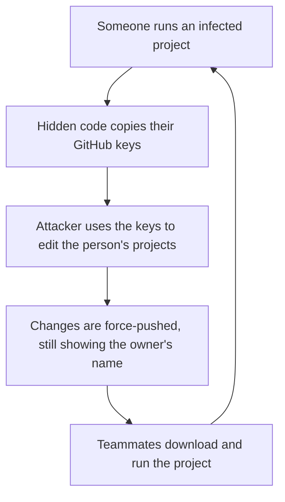

I was saving some changes to my portfolio when Git refused. It said the copy of my project on GitHub had been changed by someone else. That was odd, because nobody else works on it.

So I compared the two versions. Everything looked the same, except one settings file. At the end of its last line there was a long stretch of blank space, and past the edge of the screen sat thousands of characters of scrambled code I had never written.

Over the next week I found the same thing in **56 of my 68 projects**. I cleaned them all. Two days later, it came back.

This post is the guide I wish I'd had. You don't need a security background to follow it. If you build things with AI tools, copy projects from tutorials, or have ever run a project someone sent you, it's written for you.

**What you'll get:**

- What this attack is and why it's so easy to miss, with a demo you can try
- A **1-minute self-check** to see if you're affected
- **Four safe checks** you can run on your own projects (they only read, never change anything)
- What to do if you're infected, in order
- How to **lock your branches with rulesets**, with a builder you can play with
- A **10-minute checklist** to protect your repos from now on

---

## First, a few words in plain English

If words like "token" or "force-push" make your eyes glaze over, tap through these first. Everything else builds on them.

<Glossary terms={[
  { term: "Repository (repo)", plain: "A project folder that Git tracks. It remembers every version of every file, so you can go back in time.", analogy: "A notebook where every page you've ever written is kept, even after you tear it out." },
  { term: "Commit", plain: "A saved snapshot of your project at one moment, with your name and a message attached.", analogy: "A dated, signed page in that notebook." },
  { term: "Push / force-push", plain: "Push uploads your commits to GitHub. A force-push replaces what's on GitHub, even if that erases history.", analogy: "Push adds new pages. Force-push rips pages out and glues in different ones, keeping the same page numbers." },
  { term: "Token", plain: "A secret key that lets a tool (like the GitHub app on your laptop, or your code editor) act as you on GitHub without your password.", analogy: "A spare house key you gave to a cleaner. It opens the door by itself, no password needed." },
  { term: "OAuth app", plain: "A tool you clicked 'Authorize' for, like VS Code, the GitHub CLI, Vercel or a deploy service. Each one gets its own token.", analogy: "Each person you handed a spare key to." },
  { term: "Payload", plain: "The actual harmful code that runs on your computer.", analogy: "What the burglar does once they're inside." }
]} />

---

## What happened, in one picture

The attack is a **worm**: malware that copies itself to new places on its own. Here's the loop:



The clever part is step 4. The changes appear under **your** name, on top of your latest real work. Your history looks normal unless you know what to look for.

And it spreads to every project your keys can reach, including ones you **share with other people**. In my case it pushed into teammates' projects too. That was the part that worried me most.

---

## Where it hides: three places you never read

Malware is only dangerous if it runs. This worm hides in files that run **automatically**, files that most people never open.

### 1. Inside a settings file, pushed off-screen

Web projects have small config files (like `postcss.config.mjs`) that run every time you start the app. The worm adds its code to the end of one, after hundreds of invisible tab characters. Try finding it:

<HiddenCode />

### 2. In `package.json`, the file that starts your app

`package.json` lists commands like `npm run dev`. The worm changes them so they run its file first:

| Before | After |
|---|---|
| `"dev": "next dev"` | `"dev": "node api.js && next dev"` |

Your app still starts normally, so you notice nothing. But `api.js` (about 30,000 characters of scrambled code) runs first, every time.

### 3. In VS Code, the moment you open the folder

VS Code can run "tasks" automatically when you open a folder. The worm adds a hidden one (in `.vscode/tasks.json`) that runs a file disguised as a font, with a name like `fa-solid-300.llf`. It doesn't show up as a normal task, and it's set to never show its window.

If VS Code ever asked you to **"Allow automatic tasks"** and you clicked Allow, opening an infected folder was enough.

---

## The mistake almost everyone makes

After I cleaned everything up, I did what most people would do. I changed my password, turned on two-factor login, and signed out of every device. Two days later the worm pushed into twenty of my projects again.

<Quiz
  question="You change your GitHub password and sign out everywhere. Is the attacker locked out?"
  options={[
    { text: "Yes, a new password locks everyone out.", explain: "This is the trap. A password only protects logging in. Tools you authorized hold their own separate keys (tokens), and those keep working after a password change." },
    { text: "Only if I also turn on two-factor login.", explain: "Two-factor login protects future logins, but a stolen token never needs to log in. It's already 'inside'." },
    { text: "No. Every app's key has to be revoked too.", correct: true, explain: "Exactly. Your editor, the GitHub CLI, deploy tools: each holds its own key. Until you revoke them, a stolen copy still works. That's how the worm came back for me." }
  ]}
/>

Think of it this way: changing your password is like **changing your front-door lock**. But you also gave spare keys to your cleaner, your neighbour and your plumber. Those spare keys aren't affected by the new lock. You have to collect each one.

Two details caught me out:

- On GitHub's **Authorized OAuth Apps** page, the **"Revoke all" button skips GitHub's own apps**, like the GitHub CLI. You have to revoke those one by one.
- GitHub has two pages that look almost identical, **"Authorized GitHub Apps"** and **"Authorized OAuth Apps"**. Revoking on one does nothing for the other.

---

## Are you affected? A 1-minute check

Answer honestly. Your answers stay on this page and aren't sent anywhere.

<InfectionCheck />

---

<h2 id="check-yourself">The four safe checks</h2>

These checks **only read** your files. They don't change, delete or run anything. Open a terminal **inside a project folder** (in VS Code: *Terminal → New Terminal*), paste a command, and press Enter. Repeat for each project you care about.

<Command
  step={1}
  title="Look for files the worm adds"
  command={'git ls-files "*api.js" "*.llf" "*.lkf" ".vscode/tasks.json"'}
  does="Lists any files in this project that match the names the worm uses."
  lookFor="An api.js you didn't write, or any .llf/.lkf file. If tasks.json shows up, open it and search for folderOpen. If nothing prints, that's good."
/>

<Command
  step={2}
  title="Search the whole history for the hidden code"
  command={`git log --all --oneline -S "global['"`}
  does="Searches every saved version of every file, on every branch, for a marker every version of this payload carries."
  lookFor="Any line of output means a past or present version contained it. No output is good."
/>

<Command
  step={3}
  title="Check whether your start commands were changed"
  command={'git log --all --oneline -S "node api.js"'}
  does="Finds any version of the project where a command was changed to run api.js first."
  lookFor="Any output is a strong sign of this worm. No output is good."
/>

**Check 4 is on the GitHub website, no command needed:**

1. Open one of your repos on GitHub and go to its **Activity** page (add `/activity` to the end of the repo's web address). It shows every push, including **force pushes**. Any force push you didn't make is a red flag.
2. Look at the times on recent commits. Commits under your name at times you know you weren't working are a warning sign.
3. Go to **github.com → your profile picture → Settings → Applications**. Look through the authorized apps. Anything you don't recognise, revoke.

If any check turns something up, move to the next section. If everything is clean, skip to [guarding your repos](#guard-your-repos).

---

<h2 id="lock-it-down">If you're infected: lock it down, in this order</h2>

Do these **from your phone or another computer** if you can, in case your laptop is the thing leaking keys. Tick each one off as you go; your progress is saved on this page.

<Checklist
  id="worm-lock-it-down"
  title="Lock it down"
  items={[
    { title: "Revoke every authorized app", how: "GitHub → Settings → Applications. On the 'Authorized OAuth Apps' tab click 'Revoke all', then revoke GitHub's own apps (like GitHub CLI) one by one with the '…' menu. Then do the same on the 'Authorized GitHub Apps' tab.", why: "This kills the stolen keys. It's the step most people miss, because a password change doesn't do it." },
    { title: "Delete personal access tokens and SSH keys", how: "Settings → Developer settings → Personal access tokens (both 'Fine-grained' and 'Tokens (classic)'). Then Settings → SSH and GPG keys.", why: "These are other kinds of keys that also work without your password." },
    { title: "Change your password and turn on two-factor login", how: "Settings → Password and authentication. Use an authenticator app or passkey, not SMS if you can avoid it.", why: "Stops someone logging in as you with a stolen password." },
    { title: "Sign out of all sessions", how: "Settings → Sessions → revoke every session except the one you're using.", why: "Logs out any browser the attacker might be using." },
    { title: "Prove the old keys are dead", how: "On your laptop, run: gh auth status. If it still says you're logged in with an old key, the key wasn't revoked. A revoked key shows an error.", why: "Don't trust that a button worked. Check. For me, the attack only stopped once this showed an error." },
    { title: "Warn people you share projects with", how: "Message anyone whose repos you can push to. Ask them not to run affected branches, and to turn on branch protection.", why: "The worm uses your access to spread to them." },
    { title: "Change the secrets in your hosting and deploy tools", how: "Vercel, Netlify, Railway, Supabase and so on: regenerate API keys and update environment variables.", why: "The settings-file version runs during builds, where those secrets live." },
    { title: "Clean your projects, and their history", how: "Delete the files from the checks above and undo the package.json change. To remove them from history too, ask a developer friend or follow the engineering notes at the end of this post.", why: "A cleanup only fixes the latest version. Old versions still contain the payload, one checkout away." }
  ]}
/>

Then **sign in again with only what you need**, and watch your account for a day or two. If new pushes you didn't make appear, the computer you signed in on may still be leaking keys. Back up your work and get the machine wiped.

---

<h2 id="rulesets">Put locks on your branches: rulesets, explained</h2>

Everything above is about keys. This part is about **locks**.

GitHub lets you set **rules on a branch** (usually `main`, where your real, working version lives). A set of rules is called a **ruleset**. Rules apply even to someone holding a valid key: if the rule says "no force-pushes", a stolen key can't force-push either.

Think of `main` as a page in a notebook. Normally, anyone with your key can rip pages out and glue in new ones. A ruleset turns it into a page you can only **add** to, never tear out.

<RulesetBuilder />

### Setting one up: about 2 minutes, all clicks

1. Open your repo on GitHub and click **Settings** (the tab at the top of the repo, not your account settings).
2. In the left sidebar, under *Code and automation*, click **Rules → Rulesets**.
3. Click **New ruleset → New branch ruleset**.
4. Give it a name, like `protect-main`, and set **Enforcement status** to **Active**.
5. Under **Target branches**, click **Add target** and choose **Include default branch**. To protect every branch, choose **Include all branches**.
6. Under **Branch rules**, tick **Restrict deletions** and **Block force pushes**. Add the others from the builder above if they suit you.
7. Click **Create**.

**Leave the bypass list empty.** Anyone on it ignores the rules, and if you add yourself, a stolen copy of your key ignores them too.

### The strongest lock: signed commits

A normal commit just *says* who wrote it, and anyone can type your name. A **signed** commit carries a digital signature made with a key that only exists on your computer. The worm's commits used my name, but it couldn't have signed them.

Two settings make this work:

- **Sign your commits.** If you already use an SSH key with GitHub, it's three commands, plus adding the same key on GitHub as a **Signing key** (*Settings → SSH and GPG keys → New SSH key → Key type: Signing key*):

```bash
git config --global gpg.format ssh
git config --global user.signingkey ~/.ssh/id_ed25519.pub
git config --global commit.gpgsign true
```

- **Turn on vigilant mode.** *Settings → SSH and GPG keys →* tick **Flag unsigned commits as unverified**. From then on, any commit under your name that you didn't sign shows a yellow **Unverified** badge, so a forged one stands out at a glance.

With both in place, add **Require signed commits** to your ruleset, and GitHub refuses unsigned commits on that branch altogether.

### What rulesets can and can't do

- **Free accounts: public repos only.** On GitHub Free, rulesets (and the older "branch protection" settings) work on public repos. Private repos need GitHub Pro or a Team plan.
- **They're locks, not a replacement for revoking keys.** A stolen key with full access to a repo you own could switch the rules off. Rulesets stop automated rewrites like the ones I saw, and they make an attack slower and noisier, but after a break-in, revoking keys still comes first.
- **Teams can protect everything at once.** Organization owners can create rulesets for every repo under *Organization settings → Repository → Rulesets*.

---

<h2 id="guard-your-repos">Guard your repos: a 10-minute checklist</h2>

Even if you're clean, these make it far harder for this kind of attack to start or spread.

<Checklist
  id="worm-guard"
  title="Guard your repos"
  items={[
    { title: "Never run a project someone sends you on your main computer", how: "Open it in GitHub Codespaces, a virtual machine, or a spare computer with nothing important on it. Read the files before you run anything.", why: "Fake 'take-home tests' and 'fix this bug' requests are a common way these attacks start." },
    { title: "Turn off automatic tasks in VS Code", how: "VS Code → Settings → search 'automatic tasks' → set 'Task: Allow Automatic Tasks' to off. If a pop-up ever asks, click 'Disallow'.", why: "Stops the open-the-folder variant completely." },
    { title: "Add a ruleset to your main branch", how: "Repo → Settings → Rules → Rulesets → New branch ruleset. Target the default branch, set it to Active, tick 'Restrict deletions' and 'Block force pushes', and leave the bypass list empty. Step-by-step in the rulesets section above.", why: "The worm rewrites history with force-pushes. A ruleset stops that, even for someone holding your key." },
    { title: "Sign your commits and turn on vigilant mode", how: "Set up SSH commit signing (three commands in the rulesets section), then Settings → SSH and GPG keys → tick 'Flag unsigned commits as unverified'.", why: "Commits under your name that you didn't sign show as Unverified, so forged ones stand out." },
    { title: "Review authorized apps every few months", how: "Settings → Applications. Revoke anything you no longer use.", why: "Fewer keys means fewer things to steal." },
    { title: "Use keys that expire", how: "When you create a personal access token, choose 'Fine-grained', give it access to only the repos it needs, and set an expiry date.", why: "A stolen key that expires next month is much less dangerous than one that lasts forever." },
    { title: "Add a passphrase to your SSH key", how: "When you create one with ssh-keygen, type a passphrase instead of pressing Enter on an empty one.", why: "A stolen key file is useless without the passphrase." },
    { title: "Glance at diffs before you push", how: "In VS Code's Source Control panel, click a changed file before committing. Be suspicious of changes to config files, package.json or .vscode that you didn't make.", why: "It's the cheapest early warning there is." }
  ]}
/>

---

## What I'd tell my past self

- **The danger isn't code you read. It's code that runs automatically.** Config files, start commands and editor tasks are worth a second look.
- **"Changed my password" is not the same as "locked them out."** Revoke every app's key, then prove it worked.
- **Your access is other people's risk.** If you can push to a teammate's project, so can anyone who steals your keys.

If this helped, share it with someone who's just starting out. They're the ones most likely to click "Allow" on that pop-up.

---

<details>
<summary><strong>For engineers: how I scoped and purged 56 repos</strong> (click to expand)</summary>

**Scope without executing.** I took bare mirror clones of every repository. A bare clone has no working files, so there's nothing for an editor or package manager to run. A small Python scanner then read every blob reachable from every branch, tag and pull request ref (`git rev-list --objects --all` piped into `git cat-file --batch`) and classified them: marker in a config file, marker in any other file (whole-file payload), `node api.js` in `package.json`, `folderOpen` in `tasks.json`, `allowAutomaticTasks` in settings, font extensions without real font magic bytes, and the three `.gitignore` lines the worm adds (`temp_auto_push.bat`, `temp_interactive_push.bat`, `branch_structure.json`). Watch for false positives: EOT fonts keep their magic bytes at offset 34, and security tools contain these signatures as test data.

**Full history matters.** A first check of default branches found 31 infected repos. The full scan found 56: the rest had the payload on other branches or further back in history.

**Rewrite on copies, then prove it.** Using `git-filter-repo` on a copy of each mirror: `--strip-blobs-with-ids` and `--invert-paths` for whole-file payloads, and a blob callback to trim config files at the marker and remove the `node api.js && ` prefix. Before pushing, I rescanned every rewritten repo (expecting zero findings) and diffed every branch tip against the backup. The only removals allowed were the payload files and `tasks.json`; the only edits allowed were `.gitignore`, `package.json`, `postcss.config.*` and `.vscode/settings.json`. Then a dry-run push, the real push, and a fresh re-clone from GitHub for a final rescan.

**Fingerprints.** The rewritten commits kept the original author name and author date, but the *committer* timezone was UTC−7/−8 against my UTC+1. Several "fixes" were titled "security: remove supply-chain malware dropper" and swapped one dropper for another. On the second wave, pushes came every 9 to 12 minutes, across a dozen branches at a time.

**Proving the attacker was out.** Tokens on my machine were tested directly against the API until they returned `401 Bad credentials`. After signing in with one fresh token, I watched the account's push events for two hours and matched each one against the commits I was restoring: 14 pushes, all mine.

**Leftovers.** GitHub keeps pull request refs pointing at the old commits, and you can't rewrite those yourself. GitHub Support can garbage-collect them if you send the list of repositories and affected pull requests.

[Snare](https://github.com/AviOfLagos/snare) already detects the VS Code auto-run variant. The settings-file and `api.js` variants described here aren't covered yet, and adding detections for them is my next contribution.

</details>
